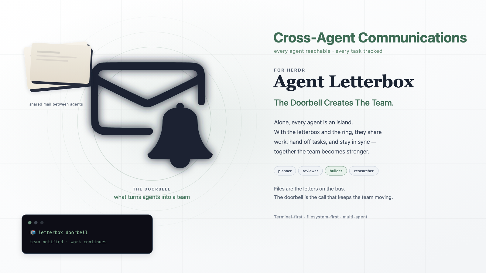

# Agent Letterbox for Herdr

## Ring the bell. Create the team.



**Agent Letterbox for Herdr turns separate coding-agent terminals into a live team inside [Herdr](https://herdr.dev).**

## What it is

Agent Letterbox is not a model, a new terminal, or a second agent harness. It is the coordination layer that lets the agents you already run hand work to one another without making you the human message relay.

A task lands as a durable letter in a teammate's inbox. The doorbell rings, alerting the agent to check it:

```text
📬 letterbox doorbell: unacked <type> in <letterbox>/<agent>/inbox/ — please check
📬 letterbox doorbell: unacked <type> in <letterbox>/<agent>/inbox/ — please check · <8-lowercase-hex>
```

The agent wakes, picks up the real task from disk, replies, and keeps the work flowing. The terminal gets a ring; the inbox keeps the message.

> **Agent mail that waits safely—and a bell brings it alive.**

## The Agent Letterbox family

One product per terminal — the same letters, the same protocol, and the same core test suite, plus the tests each terminal needs. Pick the one matching the terminal you already run:

- **[cmux](https://github.com/SimonMallas/agent-letterbox-cmux)** — primary entry point
- [tmux](https://github.com/SimonMallas/agent-letterbox-tmux)
- [Herdr](https://github.com/SimonMallas/agent-letterbox-herdr)
- [Zellij](https://github.com/SimonMallas/agent-letterbox-zellij) — terminal ring requires `LETTERBOX_ZELLIJ_SUBMIT=1`

You are reading the **Herdr** edition.

## Why it exists

Without coordination, a multi-agent workflow means juggling panes, copying task text, remembering who owns what, and hoping an agent eventually sees a message.

Directly injecting the full task into another terminal is fast, but the terminal becomes the only message record. Agent Letterbox keeps the fast part—the live doorbell—while putting the actual work in a durable, inspectable letter.

```text
full task    → durable inbox letter
live wake-up → short generic doorbell
reply        → sender inbox
archive      → recipient processed history
```

Read the full comparison in [Why Letterbox?](docs/why-letterbox.md).

## How a task moves

Public v0.3 keeps the v0.2 **correctness** lifecycle and adds operational reading verbs plus additive doorbell tokens.

```text
send task (requires_ack=true)
  → recipient: reply ack     # accepted WIP; letter stays in inbox (.md.ack)
  → recipient: does the work
  → recipient: reply result  # terminal; letter moves to processed/
```

Non-task letters (`info` / `status` / received replies) are filed with no invented response:

```bash
letterbox file <id>
```

v0.3 adds operational verbs for the receiving agent:

```bash
letterbox check                       # open work, live first, stale last; never prints bodies
letterbox read <id|display-id|token>  # print the exact durable letter
letterbox progress <ref> <one-line>   # note progress on accepted work (updates the .ack sidecar)
letterbox nudge <id|display-id|token> # re-ring an open letter without creating one
letterbox token <8hex>                # resolve a doorbell token (unhandled / filed / unknown)
```

Doorbell lines may carry an additive opaque token (`… — please check · <8hex>`); tokenless v0.2 lines remain valid knocks — match by prefix/pattern, never exact equality. A `requires_ack: false` letter may also be closed in one step with `letterbox reply <id> result|nack <slug>`.

See [SPEC.md](SPEC.md) and [docs/lifecycle.md](docs/lifecycle.md).

## What this opens up

- **Near-instant coordination** — a live Herdr agent can receive a doorbell and begin its next turn without human copy/paste.
- **Real handoffs** — implementation, review, research, QA, and fixes can move between agents as explicit owned work.
- **Local pane orchestration** — Herdr's pane API targets the right live terminal while Letterbox keeps the durable record.
- **Durable recovery** — if an agent is offline, restarting, busy, or misses the bell, the task remains in its inbox.
- **Clear responsibility** — task letters require ACK/NACK/RESULT; ACK means in progress, not done.
- **Evidence over claims** — inbox, reply, sidecar, and processed files show what happened even when an agent conversation is gone.
- **Less human relay work** — you direct the team instead of pasting the same request between terminals.

## What you need

- Bash, Git, and **Herdr 0.7+** (`herdr --version`)
- A running local Herdr session (`herdr` started; local socket only)
- Agents you already run in terminals (any coding-agent CLI you already use)

Agent Letterbox for Herdr is local-only and purpose-built for live Herdr agent teams.

## Install (copy / paste)

### Option A — Recommended: copy/paste installer

```bash
curl -fsSL https://raw.githubusercontent.com/SimonMallas/agent-letterbox-herdr/main/install.sh | sh
export PATH="$HOME/.local/bin:$PATH"
letterbox herdr setup --agents planner,reviewer,builder,researcher --automatic-doorbells
source "$HOME/.agent-letterbox/env.sh"
```

To update later, run the same installer again:

```bash
curl -fsSL https://raw.githubusercontent.com/SimonMallas/agent-letterbox-herdr/main/install.sh | sh
```

### Option B — Manual Git install

```bash
git clone https://github.com/SimonMallas/agent-letterbox-herdr.git \
  ~/src/agent-letterbox-herdr
cd ~/src/agent-letterbox-herdr
chmod +x bin/letterbox adapters/*.sh tests/*.sh
export PATH="$PWD/bin:$PATH"
letterbox herdr setup --agents planner,reviewer,builder,researcher --automatic-doorbells
source "$HOME/.agent-letterbox/env.sh"
```

Check:

```bash
letterbox --version
herdr --version
echo "$LETTERBOX_DIR"
```

## Launch agents (you choose the panes)

Open Herdr and arrange agents however the task requires. In **each agent pane**:

```bash
source "$HOME/.agent-letterbox/env.sh"

letterbox herdr run planner -- <your-agent-cli>
# other panes:
letterbox herdr run reviewer -- <your-agent-cli>
letterbox herdr run builder -- <your-agent-cli>
letterbox herdr run researcher -- <your-agent-cli>
```

`herdr run` registers the current Herdr pane id **and** `HERDR_SOCKET_PATH` for live doorbells, then starts the command.

If a pane was rebuilt:

```bash
letterbox herdr register planner
letterbox herdr status
```

## Send a live handoff (ack, then result)

```bash
source "$HOME/.agent-letterbox/env.sh"
export LETTERBOX_AGENT=planner

printf '%s\n' 'Review src/auth.ts and report correctness findings.' |
  letterbox send reviewer delegate auth-review --ack --now
```

Prefer `printf … | letterbox …` for bodies. Avoid unquoted heredocs when the text may contain `$` or backticks. The CLI owns frontmatter; only the body goes on stdin.

1. Letter lands in the reviewer’s inbox
2. Doorbell is injected into the reviewer’s registered Herdr pane when submit is on (`pane send-text` + Enter)
3. The reviewer accepts (non-terminal):

```bash
printf '%s\n' 'ACK: reviewing auth.ts now.' |
  LETTERBOX_AGENT=reviewer letterbox reply <message-id-or-inbox-path> ack auth-review --now
```

4. The letter stays in inbox with an `.md.ack` sidecar (`letterbox check` shows `[ACCEPTED]`)
5. When finished, close it:

```bash
printf '%s\n' 'RESULT: no critical issues; two nits in findings.md.' |
  LETTERBOX_AGENT=reviewer letterbox reply <message-id-or-inbox-path> result auth-review --now
```

Only `nack` or final `result` moves the original letter to `processed/`.

> `LETTERBOX_HERDR_SUBMIT=1` (set by `--automatic-doorbells`) injects into a live pane. Use dedicated agent panes only. Without it, the adapter prefers a notification toast over terminal input.

## Using a pre-release checkout

If you installed an earlier checkout from `main`, reinstall from the current branch and use the lifecycle commands above. v0.3 adds operational verbs (`check --recent|--thread`, `read`, `progress`, `nudge`, `token`), an additive doorbell token suffix, one-shot `result|nack` on `requires_ack: false` letters, and `file <path> --read` for path-form terminal replies. v0.2 added an optional `thread` field to ownership replies; existing letters remain valid. Early scripts that send `ack`, `nack`, or `result` directly must use `letterbox reply` instead, and delegates must include `--ack`. All agents in one team should run the same helper.

## Test

```bash
make test
```

Requires a running local Herdr server (`herdr status` shows running).

## Learn more

**If you are an agent, start here:** [skills/agent-letterbox/SKILL.md](skills/agent-letterbox/SKILL.md) — the operating manual. It carries the doorbell acceptance rule you need to recognise a knock, the reply lifecycle, and the safety boundaries. The list below is background.

- [docs/lifecycle.md](docs/lifecycle.md) — task vs non-task, ACK/NACK/RESULT, `file`
- [docs/why-letterbox.md](docs/why-letterbox.md) — why durable letters plus generic doorbells beat direct task injection
- [docs/team-setup.md](docs/team-setup.md) — full Herdr team bootstrap
- [docs/herdr.md](docs/herdr.md) — adapter details, registry/socket, safety, recovery
- [SPEC.md](SPEC.md) — normative protocol (v0.3)
- [SECURITY.md](SECURITY.md) — threat model
- [ROADMAP.md](ROADMAP.md) — scope and deferred items
- [CHANGELOG.md](CHANGELOG.md) — user-visible changes

## License

[MIT](LICENSE)
